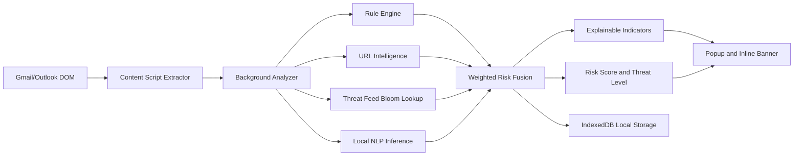

# Production Architecture

## 1. System Architecture

PHIS Sentinel uses a local-first, serverless architecture:

- Content layer: Gmail and Outlook parsers capture visible email artifact data.
- Analysis layer: Rule engine, URL intelligence engine, local threat feed engine, NLP/ML engine.
- Scoring layer: Weighted fusion model produces risk score, confidence, and threat level.
- Storage layer: IndexedDB (Dexie) persists policies, threat indicators, and local scan history.
- UI layer: Popup panel and in-page banners provide explainable verdicts.

No cloud service is required for core phishing detection.

## 2. Extension Architecture

- Manifest V3 with isolated background service worker flow.
- Host permissions restricted to Gmail and Outlook web domains.
- Content scripts only on approved mail surfaces.
- Internal message bus (`PHIS_ANALYZE_EMAIL`, `PHIS_REQUEST_ACTIVE_EMAIL`).
- Optional managed policies via enterprise deployment.

## 3. Data Flow Diagram

## 4. AI Inference Pipeline

1. Text extraction from subject/body.
2. Local transformer pipeline initialized with quantized model.
3. Inference result converted into phishing probability.
4. Probability fused with rule and URL indicators.
5. Confidence score calibrated with model certainty and rule density.

Inference path is sandboxed and local.

## 5. Model Loading Strategy

- Use quantized lightweight models (DistilBERT/MiniLM class) in browser.
- Prefer local model artifacts in extension assets.
- Browser cache enabled for faster warm starts.
- WebAssembly runtime defaults; WebGPU detection for future acceleration.
- Timeout budget enforced by policy (`maxModelLatencyMs`).

## 6. Performance and Memory Strategy

- Cap extracted links per email to bounded set.
- Use Bloom filter for O(1) local threat indicator pre-check.
- Lazy model loading (on-demand), not at extension startup.
- Single-thread ONNX WASM default to reduce endpoint CPU contention.
- Store only minimal metadata required for local explainability.

## 7. Secure Coding Approach

- Strict TypeScript and typed message contracts.
- CSP-safe implementation (no remote scripts, no eval).
- Sanitized email HTML rendering boundaries.
- Minimal privilege manifest and host scope.
- Defensive parsing and fail-closed behavior on malformed inputs.

## 8. Browser Compatibility Strategy

- Primary: Chromium Manifest V3 (Chrome, Edge, Brave).
- Plasmo abstraction for cross-browser packaging.
- Firefox support as roadmap item after MV3 and API parity assessment.
- Progressive enhancement for WebGPU; fallback to WASM.

## 9. Privacy and Compliance Considerations

- Privacy by design: email body remains local.
- No telemetry required for baseline detection.
- No plaintext export of message data by default.
- Policy-controlled logging for enterprise admin mode.
- Aligns with data minimization requirements under GDPR/CCPA principles.
